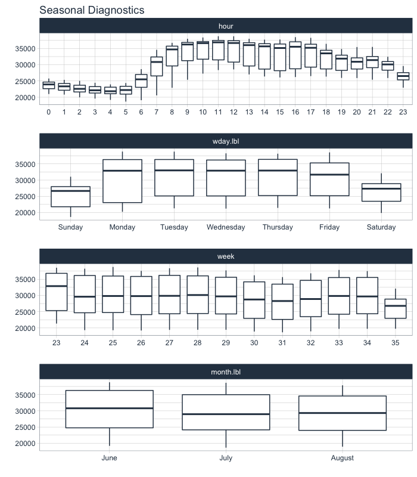
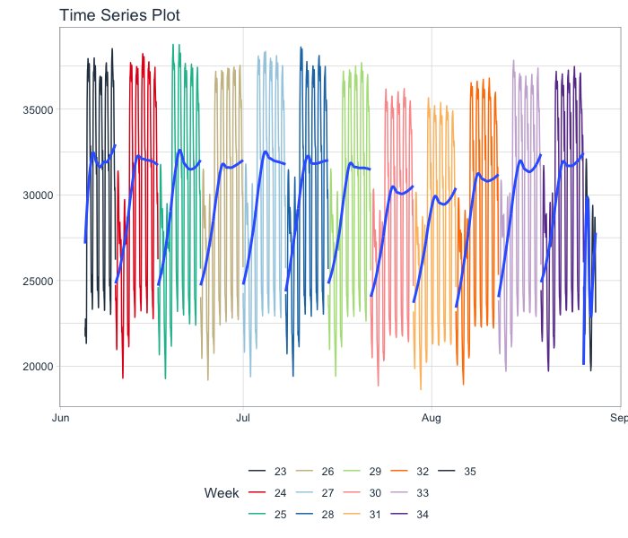

<!-- README.md is generated from README.Rmd. Please edit that file -->

# timetk


[](https://travis-ci.org/business-science/timetk)
[](https://codecov.io/gh/business-science/timetk)
[](https://cran.r-project.org/package=timetk)


> A toolkit for working with time series in R

## Mission

To make it easy to ***visualize, wrangle and preprocess time series
data*** for forecasting and machine learning prediction.

## Documentation

  - [Full Time Series Machine Learning and Feature Engineering
    Tutorial:](https://www.business-science.io/time-series/2020/03/18/time-series-machine-learning.html)
    Showcases the (NEW) `step_timeseries_signature()` for building
    ***200+ time series features*** using `parsnip`, `recipes`, and
    `workflows`.

  - [Visit the timetk website
    documentation](https://business-science.github.io/timetk/) for
    tutorials and a [complete list of function
    references](https://business-science.github.io/timetk/reference/index.html).

## Package Functionality

There are *many* R packages for working with Time Series data. Here’s
how `timetk` compares to the “tidy” time series R packages for data
visualization, wrangling, and preprocessing (those that leverage data
frames or tibbles).

<div class="comparison">

| Task                                                                                                                                | [timetk](https://business-science.github.io/timetk/) | [tsibble](https://tsibble.tidyverts.org/index.html) | [feasts](https://feasts.tidyverts.org/index.html) | [tibbletime](https://business-science.github.io/tibbletime/) |
| ----------------------------------------------------------------------------------------------------------------------------------- | ---------------------------------------------------- | --------------------------------------------------- | ------------------------------------------------- | ------------------------------------------------------------ |
| **Structure**                                                                                                                       |                                                      |                                                     |                                                   |                                                              |
| Data Structure                                                                                                                      | tibble (tbl)                                         | tsibble (tbl\_ts)                                   | tsibble (tbl\_ts)                                 | tibbletime (tbl\_time)                                       |
| [**Visualization**](https://business-science.github.io/timetk/articles/TK04_Plotting_Time_Series.html)                              |                                                      |                                                     |                                                   |                                                              |
| Interactive Plots (plotly)                                                                                                          | ✅                                                    | :x:                                                 | :x:                                               | :x:                                                          |
| Static Plots (ggplot)                                                                                                               | ✅                                                    | :x:                                                 | ✅                                                 | :x:                                                          |
| [Time Series](https://business-science.github.io/timetk/articles/TK04_Plotting_Time_Series.html)                                    | ✅                                                    | :x:                                                 | ✅                                                 | :x:                                                          |
| [Correlation, Seasonality](https://business-science.github.io/timetk/articles/TK05_Plotting_Seasonality_and_Correlation.html)       | ✅                                                    | :x:                                                 | ✅                                                 | :x:                                                          |
| [Anomaly Detection](https://business-science.github.io/timetk/articles/TK08_Automatic_Anomaly_Detection.html)                       | ✅                                                    | :x:                                                 | :x:                                               | :x:                                                          |
| [**Data Wrangling**](https://business-science.github.io/timetk/articles/TK07_Time_Series_Data_Wrangling.html)                       |                                                      |                                                     |                                                   |                                                              |
| Time-Based Summarization                                                                                                            | ✅                                                    | :x:                                                 | :x:                                               | ✅                                                            |
| Time-Based Filtering                                                                                                                | ✅                                                    | :x:                                                 | :x:                                               | ✅                                                            |
| Padding Gaps                                                                                                                        | ✅                                                    | ✅                                                   | :x:                                               | :x:                                                          |
| Low to High Frequency                                                                                                               | ✅                                                    | :x:                                                 | :x:                                               | :x:                                                          |
| Imputation                                                                                                                          | ✅                                                    | ✅                                                   | :x:                                               | :x:                                                          |
| Sliding / Rolling                                                                                                                   | ✅                                                    | ✅                                                   | :x:                                               | ✅                                                            |
| [**Preprocessing (recipes)**](https://business-science.github.io/timetk/articles/TK03_Forecasting_Using_Time_Series_Signature.html) |                                                      |                                                     |                                                   |                                                              |
| Date Feature Engineering                                                                                                            | ✅                                                    | :x:                                                 | :x:                                               | :x:                                                          |
| Holiday Feature Engineering                                                                                                         | ✅                                                    | :x:                                                 | :x:                                               | :x:                                                          |
| Fourier Series                                                                                                                      | ✅                                                    | :x:                                                 | :x:                                               | :x:                                                          |
| Smoothing & Rolling                                                                                                                 | ✅                                                    | :x:                                                 | :x:                                               | :x:                                                          |
| Imputation                                                                                                                          | ✅                                                    | :x:                                                 | :x:                                               | :x:                                                          |
| **Cross Validation (rsample)**                                                                                                      |                                                      |                                                     |                                                   |                                                              |
| [Time Series Cross Validation](https://business-science.github.io/timetk/reference/time_series_cv.html)                             | ✅                                                    | :x:                                                 | :x:                                               | :x:                                                          |
| [Time Series CV Plan Visualization](https://business-science.github.io/timetk/reference/plot_time_series_cv_plan.html)              | ✅                                                    | :x:                                                 | :x:                                               | :x:                                                          |
| **More Awesomeness**                                                                                                                |                                                      |                                                     |                                                   |                                                              |
| [Making Time Series (Intelligently)](https://business-science.github.io/timetk/articles/TK02_Time_Series_Date_Sequences.html)       | ✅                                                    | ✅                                                   | :x:                                               | ✅                                                            |
| [Handling Holidays & Weekends](https://business-science.github.io/timetk/articles/TK02_Time_Series_Date_Sequences.html)             | ✅                                                    | :x:                                                 | :x:                                               | :x:                                                          |
| [Class Conversion](https://business-science.github.io/timetk/articles/TK00_Time_Series_Coercion.html)                               | ✅                                                    | ✅                                                   | :x:                                               | :x:                                                          |
| [Automatic Frequency & Trend](https://business-science.github.io/timetk/articles/TK06_Automatic_Frequency_And_Trend_Selection.html) | ✅                                                    | :x:                                                 | :x:                                               | :x:                                                          |

</div>

## What can you do in 1 line of code?

Investigate a time series…

``` r
taylor_30_min %>%
    plot_time_series(date, value, .color_var = week(date), 
                     .interactive = FALSE, .color_lab = "Week")
```

<!-- -->

Make a seasonality plot…

``` r
taylor_30_min %>%
    plot_seasonal_diagnostics(date, value, .interactive = FALSE)
```

<!-- -->

Inspect autocorrelation, partial autocorrelation (and cross correlations
too)…

``` r
taylor_30_min %>%
    plot_acf_diagnostics(date, value, .lags = 0:(48*7), .interactive = FALSE)
```

<!-- -->

## Installation

What are you waiting for? *Download the development version with latest
features*:

``` r
# install.packages("devtools")
devtools::install_github("business-science/timetk")
```

*Or, download CRAN approved version*:

``` r
install.packages("timetk")
```

## Acknowledgements

The `timetk` package wouldn’t be possible without other amazing time
series packages.

  - [stats](https://rdrr.io/r/stats/stats-package.html) - Basically
    every `timetk` function that uses a period (frequency) argument owes
    it to `ts()`.
      - `plot_acf_diagnostics()`: Leverages `stats::acf()`,
        `stats::pacf()` & `stats::ccf()`
      - `plot_stl_diagnostics()`: Leverages `stats::stl()`
  - [lubridate](https://github.com/hadley/lubridate): `timetk` makes
    heavy use of `floor_date()`, `ceiling_date()`, and `duration()` for
    “time-based phrases”.
      - Add and Subtract Time (`%+time%` & `%-time%`): `"2012-01-01"
        %+time% "1 month 4 days"` uses `lubridate` to intelligently
        offset the day
  - [xts](https://github.com/joshuaulrich/xts): Used to calculate
    periodicity and fast lag automation.
  - [forecast (retired)](https://pkg.robjhyndman.com/forecast/):
    Possibly my favorite R package of all time. It’s based on `ts`, and
    it’s predecessor is the `tidyverts` (`fable`, `tsibble`, `feasts`,
    and `fabletools`).
      - The `ts_impute_vec()` function for low-level vectorized
        imputation using STL + Linear Interpolation uses `na.interp()`
        under the hood.
      - The `ts_clean_vec()` function for low-level vectorized
        imputation using STL + Linear Interpolation uses `tsclean()`
        under the hood.
      - Box Cox transformation `auto_lambda()` uses `BoxCox.Lambda()`.  
  - [tibbletime
    (retired)](https://business-science.github.io/tibbletime/): While
    `timetk` does not import `tibbletime`, it uses much of the
    innovative functionality to interpret time-based phrases:
      - `tk_make_timeseries()` - Extends `seq.Date()` and
        `seq.POSIXct()` using a simple phase like “2012-02” to populate
        the entire time series from start to finish in February 2012.
      - `filter_by_time()`, `between_time()` - Uses innovative endpoint
        detection from phrases like “2012”
      - `slidify()` is basically `rollify()` using `slider` (see below).
  - [slider](https://davisvaughan.github.io/slider/): A powerful R
    package that provides a `purrr`-syntax for complex rolling (sliding)
    calculations.
      - `slidify()` uses `slider::pslide` under the hood.
      - `roll_apply_vec()` uses `slider::slide_vec()` for simple
        vectorized rolls (slides).
  - [padr](https://edwinth.github.io/padr/): Used for padding time
    series from low frequency to high frequency and filling in gaps.
      - The `pad_by_time()` function is a wrapper for `padr::pad()`.
      - See the `step_ts_pad()` to apply padding as a preprocessing
        recipe\!
  - [TSstudio](https://github.com/RamiKrispin/TSstudio): This is the
    best interactive time series visualization tool out there. It
    leverages the `ts` system, which is the same system the `forecast` R
    package uses. A ton of inspiration for visuals came from using
    `TSstudio`.

# Learning More

If you are interested in learning from my advanced **Time Series
Analysis & Forecasting Course**, then [join my
waitlist](https://mailchi.mp/business-science/time-series-forecasting-course-coming-soon).
The course is coming soon.

<!-- -->

You will learn:

  - Time Series Preprocessing, Noise Reduction, & Anomaly Detection
  - Feature engineering using lagged variables & external regressors
  - Hyperparameter Tuning
  - Time series cross-validation
  - Ensembling Multiple Machine Learning & Univariate Modeling
    Techniques (Competition Winner)
  - NEW - Deep Learning with RNNs (Competition Winner)
  - and more.

<p class="text-center" style="font-size:30px;">

<a href="https://mailchi.mp/business-science/time-series-forecasting-course-coming-soon">Signup
for the Time Series Course waitlist</a>

</p>
