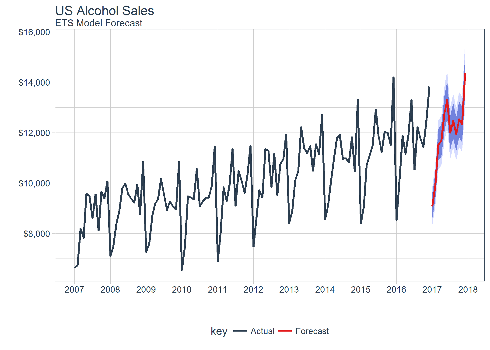
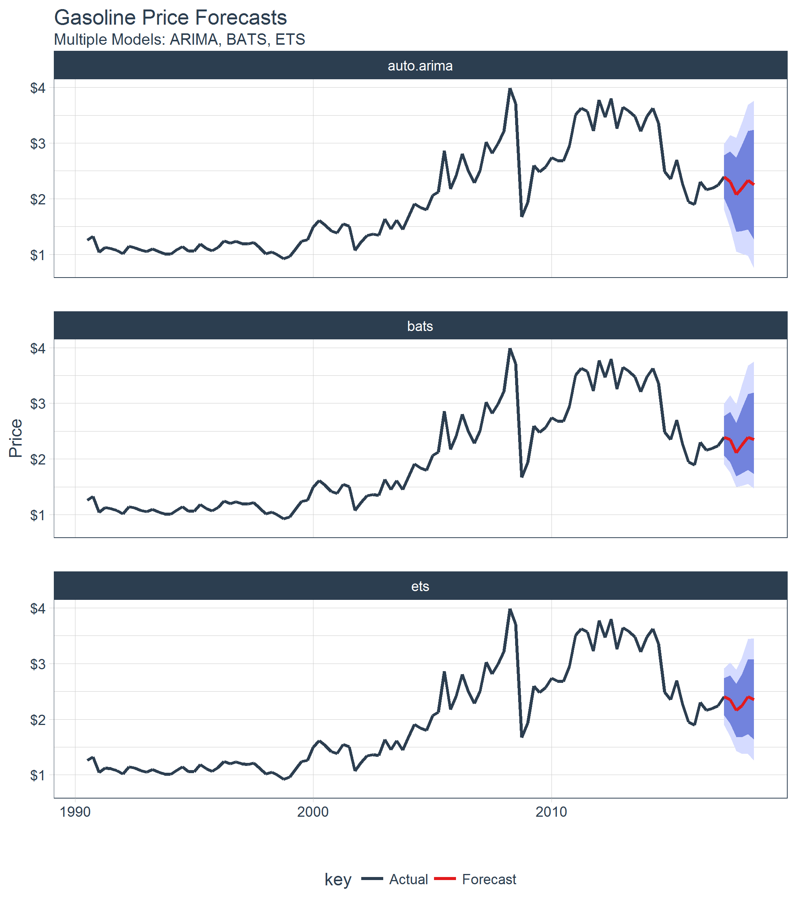

<!-- README.md is generated from README.Rmd. Please edit that file -->
sweep
=====

[](https://travis-ci.org/business-science/sweep.svg?branch=master) [](https://codecov.io/gh/business-science/sweep) [](https://cran.r-project.org/package=sweep)  

> A "tidy" toolkit for forecasting and time series analysis

The `sweep` package combines a collection of tools for performing forecasts and time series analysis in the "tidyverse". While the package is geared towards the workflow required to perform forecasts using Rob Hyndman's `forecast` package, it contains elements that can help when performing time series analysis using tibbles ("tidy" data frames).

Benefits
--------

-   **Designed for modeling and scaling forecast analyses using the the `tidyverse` tools in [*R for Data Science*](http://r4ds.had.co.nz/)**
-   **Extends `broom` for forecast model analysis**
-   **Maximizes data retention and simplifies the coercion process between time-based tibbles (`tbl`) and the major time series data types `xts`, `zoo`, `zooreg`, and `ts`**
-   **Combined with the `forecast` and `tidyquant` packages enables end-to-end time series analysis capability**

Tools
-----

The package contains the following elements:

1.  **forecast tidier**: `sw_sweep` converts a `forecast` object to a tibble that can be easily manipulated in the "tidyverse".

2.  **broom model tidiers**: `sw_tidy`, `sw_glance`, `sw_augment`, `sw_tidy_decomp` functions extend `tidy`, `glance`, and `augment` from the `broom` package specifically for models (`ets()`, `Arima()`, `bats()`, etc) used for forecasting.

3.  **coercion functions**: `sw_tbl`, `sw_ts`, `sw_xts`, `sw_zoo`, and `sw_zooreg` coerce time-based tibbles `tbl` to and from each of the main time-series data types `xts`, `zoo`, `zooreg`, `ts`, maintaining the time-based index.

4.  **index function**: `sw_index` returns the time series index of time series objects, models, and `forecast` objects. The argument `.sweep_idx` can be used to return a special sweep "index" attribute for regularized `ts` objects that returns a non-regularized date / date-time index if present.

Making forecasts in the tidyverse
---------------------------------

`sweep` enables transitioning from tibble to ts, from ts to model (e.g. Arima, ets, etc), from model to forecast, and then from forecast to tibble. The result is ability to use `dplyr`, `tidyr`, and `ggplot` natively to manipulate, analyze and visualize forecasts.



Forecasting multiple time series groups at scale
------------------------------------------------

Often forecasts are required on grouped data to analyse trends in sub-categories. The good news is scaling from one time series to many is easy with the various `sw_` functions in combination with `dplyr` and `purrr`.


Forecasting multiple models for accuracy
----------------------------------------

A common goal in forecasting is to compare different forecast models against each other. `sweep` helps in this area as well.



broom extensions for forecasting
--------------------------------

If you are familiar with `broom`, you know how useful it is for retrieving "tidy" format model coefficients (`tidy`), accuracy statistics (`glance`), and residuals (`augment`). The `sweep` package extends these functions to forecast modeling functions such as ARIMA, ETS, BATS, TBATS, NNETAR, and more: just use the `sweep` functions, `sw_tidy`, `sw_glance`, and `sw_augment`. In addition, a new tidier, `sw_tidy_decomp` is designed to specifically tidy models that produce seasonal decompositions. The compatibility chart is listed below.

| Function      | sw\_tidy() | sw\_glance() | sw\_augment() | sw\_tidy\_decomp() |
|:--------------|:----------:|:------------:|:-------------:|:------------------:|
| ar()          |            |              |               |                    |
| arima()       |      X     |       X      |       X       |                    |
| Arima()       |      X     |       X      |       X       |                    |
| ets()         |      X     |       X      |       X       |          X         |
| baggedETS()   |            |              |               |                    |
| bats()        |      X     |       X      |       X       |          X         |
| tbats()       |      X     |       X      |       X       |          X         |
| nnetar()      |      X     |       X      |       X       |                    |
| stl()         |            |              |               |          X         |
| HoltWinters() |      X     |       X      |       X       |          X         |
| StructTS      |      X     |       X      |       X       |          X         |
| tslm()        |      X     |       X      |       X       |                    |
| decompose()   |            |              |               |          X         |
| adf.test()    |      X     |       X      |               |                    |
| Box.test()    |      X     |       X      |               |                    |
| kpss.test()   |      X     |       X      |               |                    |

Extensible time series coercion
-------------------------------

The coercion functions `sw_tbl`, `sw_xts`, `sw_zoo`, `sw_zooreg`, and `sw_ts` enable maximize data retention and simplify the coercion process. Further working with regularized time series (`ts`) class has been a particular pain until now.

``` r
# Time based tibble
data_tbl <- tibble(
    date = seq.Date(from = as.Date("2010-01-01"), by = 1, length.out = 5),
    x    = seq(100, 120, by = 5)
)
data_tbl
#> # A tibble: 5 × 2
#>         date     x
#>       <date> <dbl>
#> 1 2010-01-01   100
#> 2 2010-01-02   105
#> 3 2010-01-03   110
#> 4 2010-01-04   115
#> 5 2010-01-05   120

# Coercion from time-based tibble to ts using sw_ts()
data_ts <- sw_ts(data_tbl, start = c(2010,1), freq = 365)

# Regularized numeric index
sw_index(data_ts) %>% str()
#>  num [1:5] 2010 2010 2010 2010 2010
sw_tbl(data_ts)
#> # A tibble: 5 × 2
#>      index     x
#>      <dbl> <dbl>
#> 1 2010.000   100
#> 2 2010.003   105
#> 3 2010.005   110
#> 4 2010.008   115
#> 5 2010.011   120

# Non-regularized date index 
sw_index(data_ts, .sweep_idx = TRUE) %>% str()
#>  Date[1:5], format: "2010-01-01" "2010-01-02" "2010-01-03" "2010-01-04" ...
sw_tbl(data_ts, .sweep_idx = TRUE)
#> # A tibble: 5 × 2
#>        index     x
#>       <date> <dbl>
#> 1 2010-01-01   100
#> 2 2010-01-02   105
#> 3 2010-01-03   110
#> 4 2010-01-04   115
#> 5 2010-01-05   120
```

Installation
------------

Here's how to install to get started.

Development version with latest features:

``` r
# install.packages("devtools")
devtools::install_github("business-science/sweep")
```

<!-- CRAN approved version: -->
<!-- ```{r, eval = FALSE} -->
<!-- install.packages("sweep") -->
<!-- ``` -->
Further Information
-------------------

The `sweep` package includes several vignettes to help users get up to speed quickly:

-   SW00 - Introduction to `sweep`
-   SW01 - Forecasting Time Series Groups in the tidyverse
-   SW02 - Forecasting Using Multiple Models
-   SW03 - Time Series Coercion Using `sweep`

<!-- See the [`tidyquant` vignettes](https://cran.r-project.org/package=tidyquant) for further details on the package. -->
